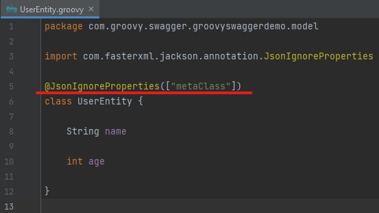

# groovy-swagger-demo
 
Simple example use open api with swagger on groovy (java) :)
 
 

[Demo page on octanium91.github.io *("Try it out" not works!)*](https://octanium91.github.io/p/groovy-swagger-demo/)

 

 ## Demo launch

 - start [**GroovySwaggerDemoApplication.groovy**](https://github.com/Octanium91/groovy-swagger-demo/blob/master/src/main/groovy/com/groovy/swagger/groovyswaggerdemo/GroovySwaggerDemoApplication.groovy) *(Java 11)*
 - Go to [http://localhost:9666/swagger/ui/](http://localhost:9666/swagger/ui/)

 ## Controllers

 - [**ExampleController.groovy**](https://github.com/Octanium91/groovy-swagger-demo/blob/master/src/main/groovy/com/groovy/swagger/groovyswaggerdemo/ExampleController.groovy) - controller with described documentation
 - [**ClearController.groovy**](https://github.com/Octanium91/groovy-swagger-demo/blob/master/src/main/groovy/com/groovy/swagger/groovyswaggerdemo/ClearController.groovy) - clean controller WITHOUT described documentation

 ## **[GUIDE]** Fixing swagger ui freez\lag\hang\loop on open request

 - use dependence [**springdoc-openapi-ui**](https://mvnrepository.com/artifact/org.springdoc/springdoc-openapi-ui) version **1.5.xx** or higher
 - add annotation **@JsonIgnoreProperties(["metaClass"])** for yours objects\models\dto *(which are used in controllers)*
 

 
